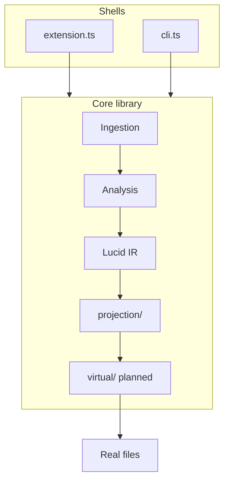

# Architecture / 架构

## Active Scope / 活跃范围

**EN:** **Core library** (`ingestion/`, `analysis/`, `projection/`, `virtual/` planned) + **VS Code extension** (`extension.ts`) + **CLI** (`cli.ts`).

**中文：** **核心库** + **VS Code 扩展** + **CLI**。

## Module Boundary / 模块边界

| Module | EN | 中文 |
| --- | --- | --- |
| `ingestion/workspace.ts` | tsconfig-scoped Project | 工作区 Project |
| `analysis/cross-file.ts` | Cross-file use/write via findReferences | 跨文件引用 |
| `analysis/trace-overlay.ts` | inferred vs observed spans | trace 叠加 |
| `ingestion/joern.ts` | Joern HTTP adapter (optional) | Joern 可选适配 |
| `analysis/` | Contracts, triggers | 合约、触发 |
| `core/` | `analyzeFile()` public API | 对外分析 API |
| `projection/` | Filter+cut → Projection Slice | 切片 |
| `virtual/` | pull/push/fork, translation scaffold | 同步、转换脚手架 |
| `extension.ts` | VS Code commands, webview, providers | 扩展壳 |
| `cli.ts` | Headless JSON output | CLI |

## Strategy Labels / 策略标注

| Strategy | Where |
| --- | --- |
| **DRY** | `contract-types`, `span.ts`, URI helpers |
| **Curry** | analyze → slice → layout → surface |
| **Meta** | `extension.ts`, webview wiring |

## Constraints / 约束

- `buildContracts()` internal; prefer `analyzeFile()` from `core/`
- Fork: same file or same directory; rebind user-confirmed
- Phase 1 push: single file/function; `save_selected` / `save_all`
